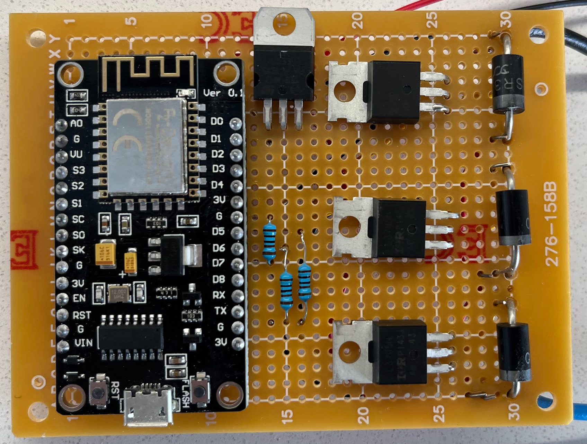
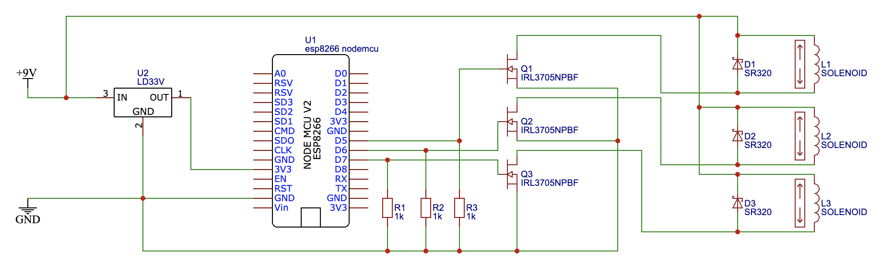
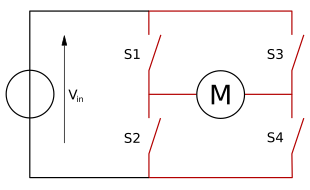
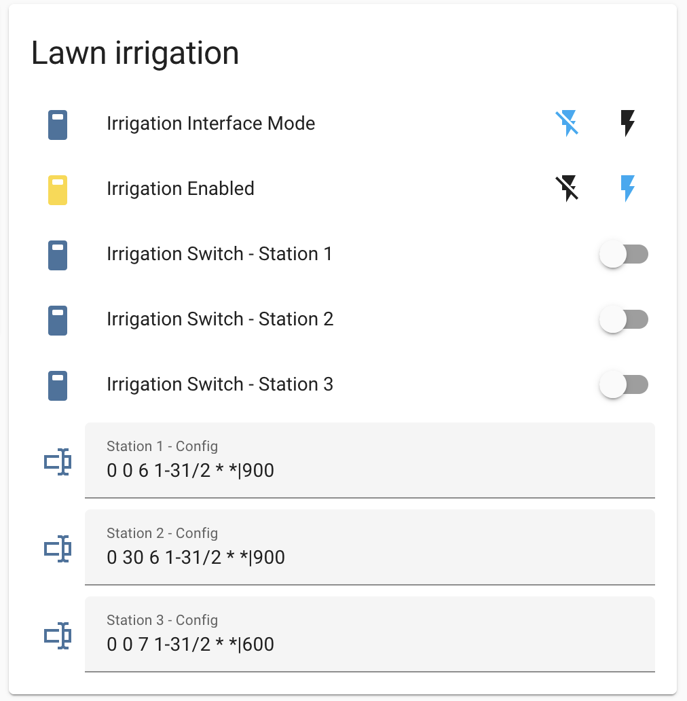
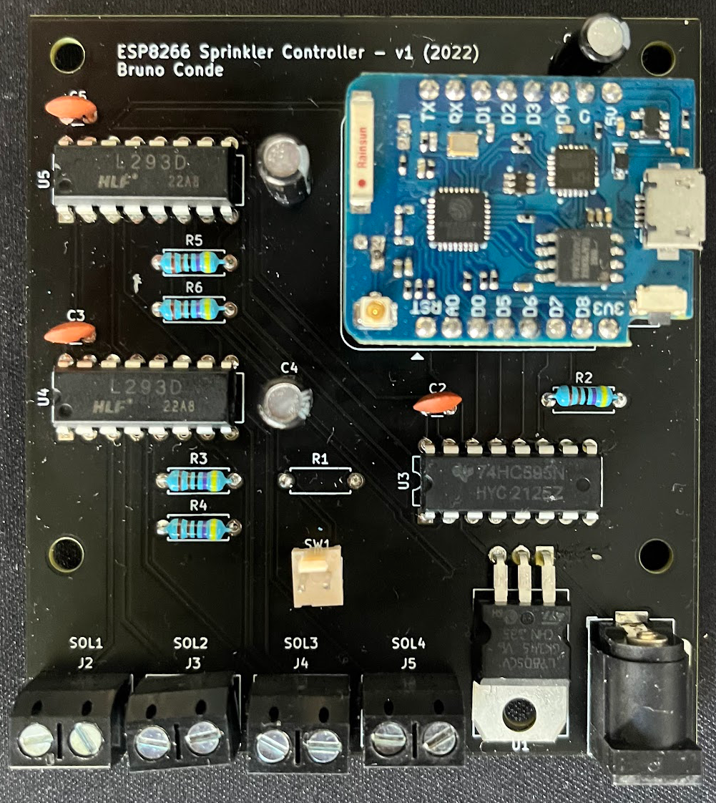
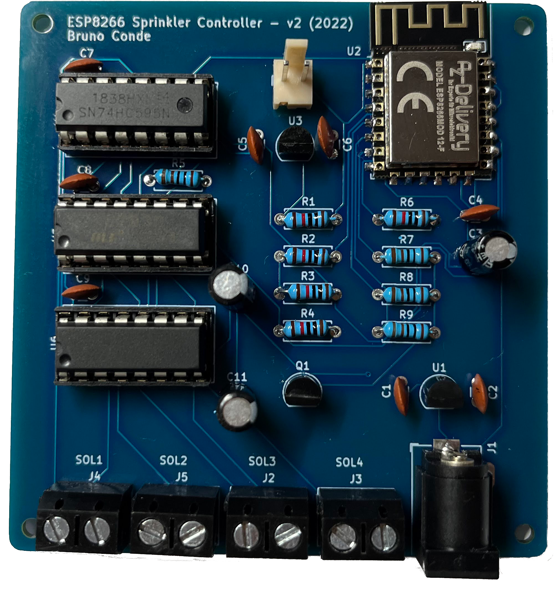
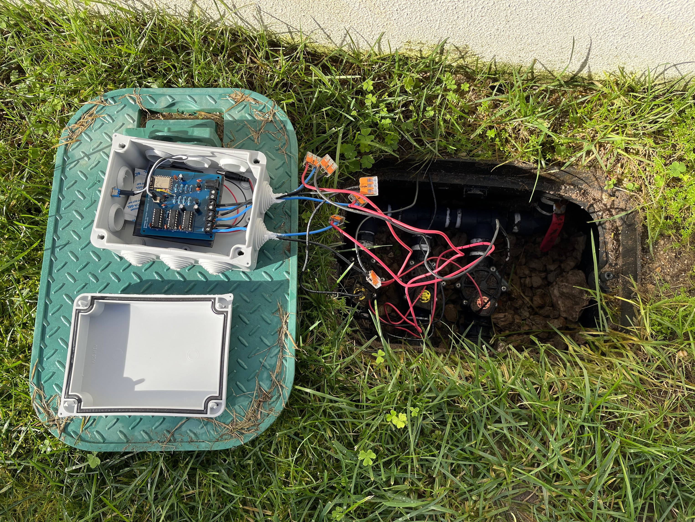
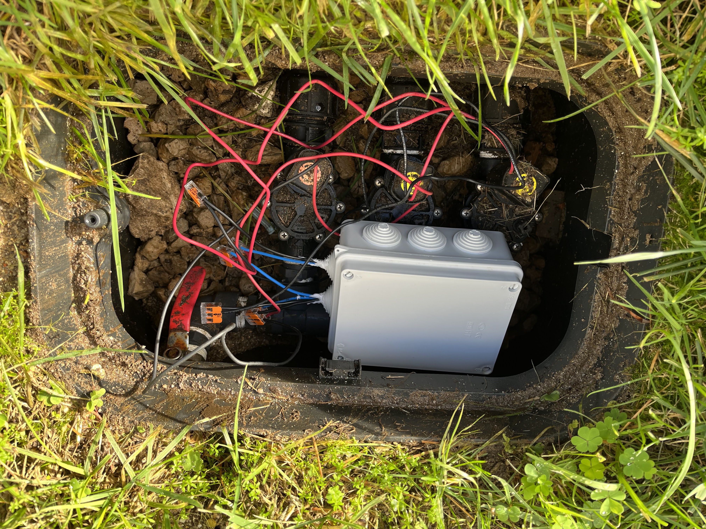

In this article, I'm going to describe how I created my own lawn irrigation controller based on an ESP8266 board.

My previous lawn irrigation system was a [Rainbird WP4](https://www.rainbird.com/). My main complaint with this system was that I could not control it remotely using a Web interface or my phone.

My lawn irrigation has 3 stations. Each station has 3 to 4 sprinklers that are controlled by the Rainbird solenoids on the main central box. These solenois are activated/deactivated directly by the Rainbird WP4. This device does not support any kind of remote control (eg. WiFi). Hence, the configuration and schedule of irrigation programs had to be done directly on the WP4.

The WP4 interface (a small OLED screen controlled with physical buttons) started to fail. There was a "sticky" button that was always pressed, preventing the interface from working properly. This problem started to occur intermittently but after a while was permanent and I could not configure the irrigation programs anymore. It was also not possible to fix the sticky button without opening the device, which was kind of designed not to be repaired (or I could not figure out a way to open the device without breaking it). 

I then started to investigate this device and this was where I found out that the WP4 only served one basic purpose: to control three *switches*, the three solenoids (one for each station).
<!--more-->

## Building my own irrigation controller

How hard can it be to build my own controller based on a ESP8266 to drive the three *switches*, effectively replacing the Rainbird WP4 controller?

The ESP8266 is powered by regulated 3.3V or unregulated power using Vin. The internal logic level works on 3.3V. 

The rainbird solenoids (and the Rainbird WP4) require a 9V battery. Hence, I thought of using the same 9V batteries for this circuit. I've also included a voltage regulator to step down from 9V to 3.3V. However, in retrospective, this voltage regulator was not necessary as the ESP8266 nodemcu board that I used for the first test already provided a voltage regulator on the VIN pin that could take up to 12V.

In order to control/switch the 9V power line needed for each solenoid, I used a [MOSFETs](https://en.wikipedia.org/wiki/MOSFET). This allowed the ESP8266 to use a lower voltage (3.3V) on the MOSFET gate to toggle the 9V power line.

[I've learned](https://www.youtube.com/watch?v=IG5vw6P9iY4) that whenever switching off a solenoid, an inductive reactance (opposition to current due to inductance) can occur. To cancel this effect, protection [schottky diodes](https://en.wikipedia.org/wiki/Schottky_diode) are used to protect other circuit components from back or forward EMF of the solenoid.

I created a simple sketch for the ESP8266 which subscribed to MQTT events in order to control each station. I could then use [Home Assistant](https://www.home-assistant.io/) to interface with the irrigation controller by publishing the appropriate MQTT events in order to control each station.

Here is a photo of the circuit:

  

### Circuit schematic v1

  

### Not quite there yet

After assembling the circuit, I was eager to try it. I disconnected the solenoids from the WP4 and connected the solenoid wires to my board. 

On the first test, I could see that the solenoid would activate as expected. However, the solenoid would not deactivate even when I turned the power off.

After a quick investigation, I discovered that I was dealing with **latching solenoids**. The solenoid state is kept even if power is turned off. In order to change the state from on to off, the voltage polarity must be inverted (-9V).

This makes perfect sense as this it is very power efficient (something very important when we have a battery powered circuit with limited capacity).

Another **important** result was that my 9V battery was completely dead after a couple of hours.

This was a first naive attempt, but enlightening nevertheless.

## Latching solenoids and the L293D

Let's try again... the first circuit wasn't quite there yet as we now have to invert the current on the solenoid terminals. How can we do this?

The answer is: using an [H-bridge](https://en.wikipedia.org/wiki/H-bridge).

  

We can also use MOSFETs to build an H-bridge circuit. However, this requires a lot more MOSFETs, thus increasing the complexity of our circuit.

If we use four MOSFETs for each H-bridge (S1, S2, S3 and S4) and we have three stations to control, we will have a total of 12 MOSFETs. 
Instead of building my own H-bridge, I discovered that there is a very common IC used for this purpose - the [L293D](https://www.ti.com/product/L293D).

The L293D includes Quadruple Half-H Drivers that are designed to provide bidirectional drive currents. It is also designed to drive inductive loads such as solenoids and motors. These ICs allow us to drive the 9v power lines to the solenoid with a 3.3v logic signal provided by the ESP8266. Perfect!

By now, I was also thinking in designing my own pcb for this project so I ordered a smaller ESP8266 board - the [ESP8266 - WeMos D1 Mini Pro clone](https://www.wemos.cc/en/latest/d1/d1_mini_pro.html).

Each L293D can control two solenoids (two stations). Since I have three stations, I need to use two L293D (four possible solenoids). Because the WeMos D1 Mini Pro only provides 11 GPIO digital pins, an 8-bit shift register was included to provide more digital lines to drive the four possible solenoids/stations.

As the included voltage regulator on the WeMos D1 Mini Pro only supports up to 7V, I needed to step down the voltage to 5V and 3.3V in order to power all the ICs in the circuit. I ended up using a [LM7805](https://www.sparkfun.com/datasheets/Components/LM7805.pdf) voltage regulator to step down from 9V to 5V. I then powered the shift register and the L293D with 5V and also the WeMos D1 Mini Pro board using the VIN pin which, in turn, converts 5V to 3.3V using the built-in voltage regulator.

After a quick test of the circuit with the L293D ICs, I started designing the pcb using [KiCad](https://www.kicad.org/) and coding all the changes for the ESP8266.

The ESP8266 code changes where significant as the mode of operating the irrigation controller was very different. In order to conserve energy, the ESP8266 had to enter deep sleep mode when it was not being used. However, only the RTC clock is working when the ESP8266 is in deep sleep mode. Therefore, I could not drive the controller directly from Home Assistant anymore as there was no WiFi connection. The controller needs to be smart enough in order to sleep only until the next scheduled station event (starting or stopping the irrigation in each station). In order to achieve this, the stations schedule was now saved on the ESP8266 internal EEPROM.

There are now two operation modes:
 - **Background mode**: the controller performs scheduled station events and goes back to deep sleep. 
 - **Interface mode**: in this mode the ESP8266 will not go into deep sleep and it will be always running. Although this mode will drain the battery very fast, it was still necessary in order to test the stations and sprinklers. This way we can completely control the stations from Home Assistant (just like in the first circuit).

Whenever the operating mode is set through Home Assistant, a **retained** MQTT event is published. In order to toggle the interface mode, one needs to manually reset the controller after setting the interface mode switch. This forces the ESP8266 to restart and will automatically process any retained MQTT messages with this flag.

Besides the interface mode, we also need a way to program the controller remotely - configure the watering schedule for each station for automatic irrigation. Within Home Assistant, I configured text input fields for each station. The field text value contains the **CRON expression** for the station, and the **duration** separated by a pipe `"|"`. When the text inputs change, a HA automation triggers and publishes the appropriate config event for each station, also with the `retained=true` flag. Once the ES8266 awakes, it will process all retained events including the station configurations and save the CRON and duration on the internal EEPROM.

There is also an an irrigation toggle switch that can be used to skip the programmed schedule. As an example, it is possible to disable the irrigation if rain is forecast for the next 12 hours or is has rained in the last 12h. This can be configured with automations directly from Home Assistant.

This is a screenshot of my Lawn irrigation card that I have configured on my Home Assistant dashboard:

  

Once the pcbs arrived, I soldered all the components and did the first test. Everything worked as expected. The solenoids where latching correctly according to the voltage polarity applied. The scheduled station events were also working as expected and the ESP8266 was in deep sleep unless any station needed to be triggered.

However, after a couple of days, I noticed that the irrigation was not working anymore. The battery was dead. :cry:

Here is a photo of second circuit I built:

  

## Power efficiency

We've done engineering 101, we've slapped the bits together and they work. Engineering 202 is making them work efficiently enough to be useful. :blush:

This is a very important topic as this circuit is powered with limited and low capacity batteries, which I didn't give enough relevance to before.

Usually, depending on the battery type, a 9v battery has a capacity of around 300 mAh. 

We must guarantee that our circuit is as efficient as possible or else the battery will be depleted quickly. Ideally, according to my calculations, the **standy current** of the circuit should not exceed **50uA**. Using this current when the circuit is in standby (or deep sleep mode), I estimate that double 9v batteries should last more than one year.

Operating normally, without any changes to improve the efficiency of the circuit, I measured the average current to vary from 90mA to 130mA. This includes the ESP8266 making WiFi requests, the two L293D ICs, the 8-bit shift register, and the added voltage regulator.

If we put the ESP8266 in deep sleep mode, the current drops to about 50/ 60mA. Still too high. The culprits are the two L293D ICs which have a very high quiescent current of about ~30mA each.

Hence, to reduce the quiescent current of the L293D ICs, the power is supplied to these ICs only when stations need to be activated/deactivated. To achieve this, a simple NPN transistor is used to turn off the shift register and both L293D ICs. This transistor is driven by the ESP8266.

As the latching solenoid is expected to consume around 400mA, I've chosen a transistor that could handle up to 1A of current on the collector and was available on my local electronics store (the [SS8050CBU](https://eu.mouser.com/datasheet/2/308/1/SS8050_D-1814986.pdf)).

In order to choose the correct base resistor value for the transistor, I've applied the following formula:

    Base resistor = (Supply voltage – Voltage drop) / (Collector current / Beta)
    Rb = (3.3-1.2)/(0.4/120) ~ 630 Ω

However, I tried several resistor values but only a 100 Ω resistor worked and fully saturated the transsitor. Therefore, my calculation must not be correct... I've read somewhere that in order to use the transistor as a switch, we don't need to consider the `Beta` or `hFE`. 

After these improvements, the current was still around 4mA. I know exactly where this current comes from - the LM7805 voltage regulator which the datasheet clearly states that its quiescent current is typically 4.2mA. I needed to find another way to efficiently step down the current from 9V to 5V. I considered DC-DC buck converters and Ultra-low quiescent current voltage regulators. An important aspect when choose an efficient voltage regulator was the max output current. We need at least 250 mA for the circuit and solenoids. I found many voltage regulators capable to do the job. However, after an exhaustive internet search, the only one that I found in stock was the [MCP1702](https://ww1.microchip.com/downloads/en/DeviceDoc/22008E.pdf).

I ended up also replacing the WeMos D1 Mini Pro with an [ESP-12F WiFi module](https://docs.ai-thinker.com/_media/esp8266/docs/esp-12f_product_specification_en.pdf) in order to reduce the standby current even further used by the ESP8266. On deep sleep, the standby current of the ESP-12F is around ~20uA.

Because of this, another voltage regulator is needed to step down from 5V to the 3.3V required by the ESP-12F. Hence, I used another MCP1702.

The resulting average standby of the circuit is now around **20uA**. :muscle: :clap:

### RTC accuracy on the ESP8266 

The max deep sleep time of the ESP-12F is around 3 to 4 hours. Therefore, we need to wake up evert 3 hours or so and get right back to sleep if no station needs to be started or stopped.

Also, it turns out that the ESP8266 just doesn't have a very precise RTC (Real Time Clock). On a 3 hour period, the ESP8266 RTC would drift ahead around 14 minutes. Without a more precise clock, the only solution is to go back to sleep for the remaining time. 

## Final PCB and Enclosure

After the new pcbs arrived, I soldered all the parts and went for another try... Everything worked as expected and the battery is still holding up. :satisfied:

Here are some photos of the final pcb and the enclosure:

  

  
  

&nbsp;

## Circuit schematic

  

## GitHub project

You can find more details about this project, along with the source code and KiCad schematics here: [https://github.com/bmpc/esp8266_sprinkler_controller](https://github.com/bmpc/esp8266_sprinkler_controller)

## Final thoughts

Although at first this seemmed to be a simple project to control three switches remotely using an ESP8266, this turned out to be a good exercise for me to learn a little bit more about the basics of electronics.

Designing a circuit to be efficient enough to run on a battery is challenging as we need to be very careful about how much current the circuit is using at any given time.

My new lawn irrigation controller has been working non stop for the past month without any problem. Let's see if it will hold up.

Until next time!

## *Disclaimer*
*I'm a software engineer with no background in electronics. Please don't consider what you read here to be best practice. Use at your own risk.*

*Nevertheless, feedback is always welcome.*

